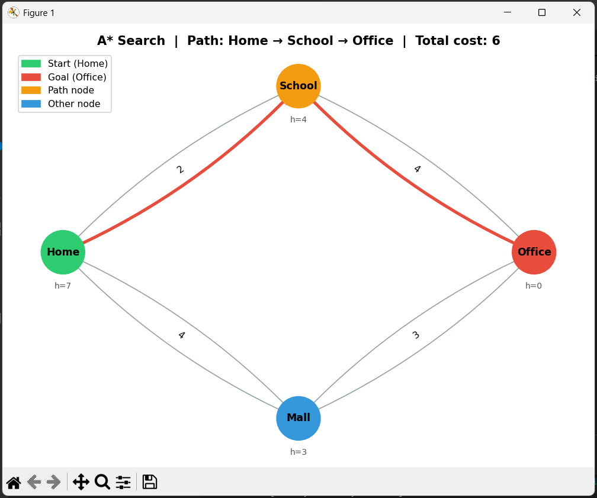
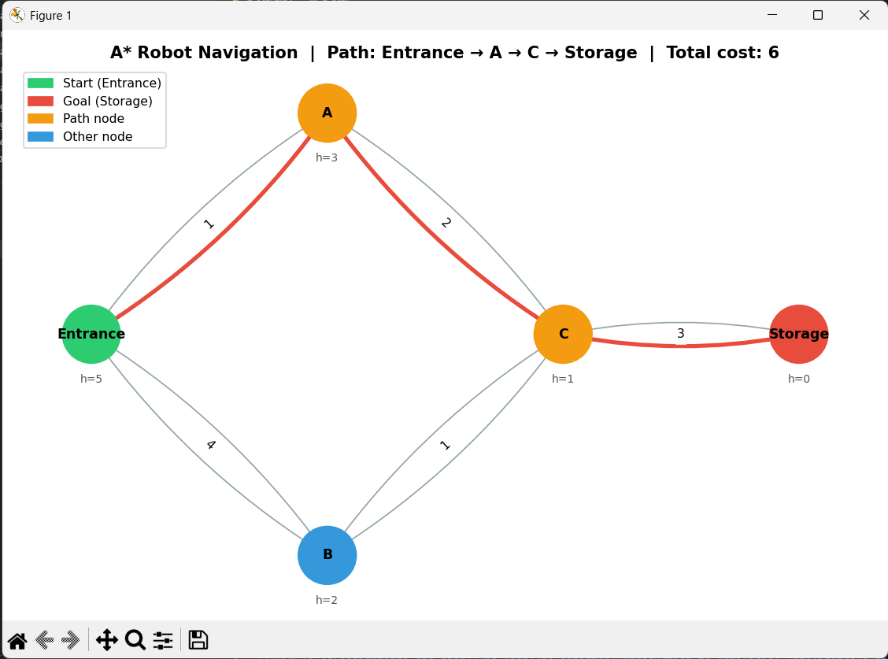
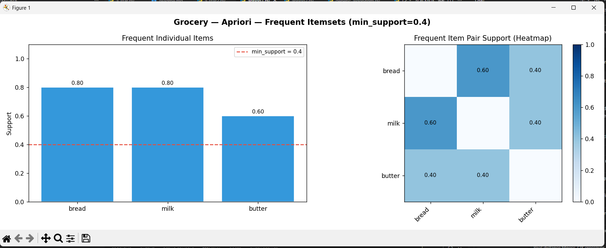
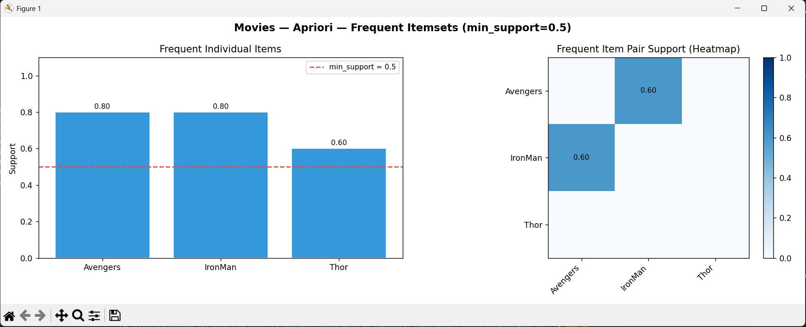
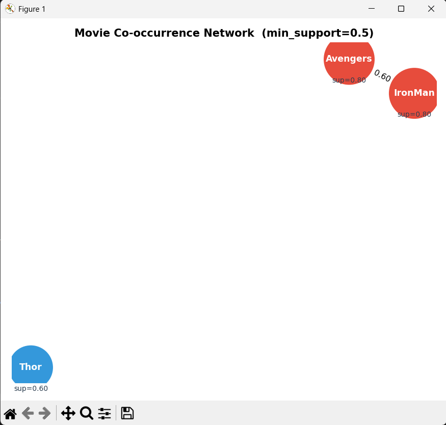
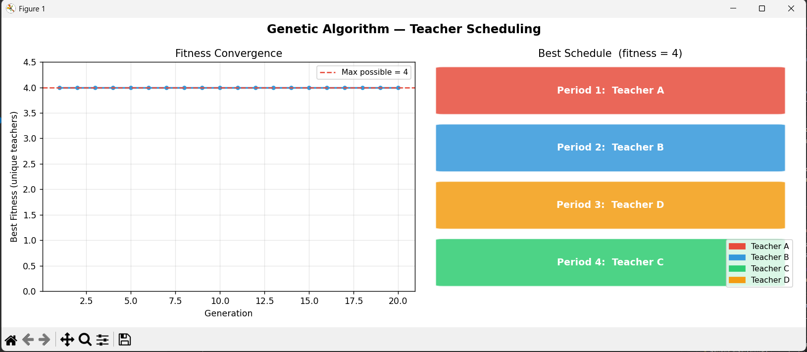
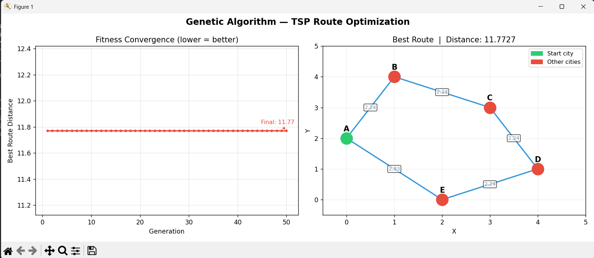

# Good day sir, I am Joshua Dave Cantorna and this is my assignment for the Introduction to Artificial Intelligence course.

# Artificial Intelligence Algorithms

This repository contains implementations of fundamental Artificial Intelligence algorithms, including A* Search, Apriori, and Genetic Algorithm. Each algorithm is demonstrated with practical real-world examples and **graph-based visualizations** using `matplotlib` and `networkx`.

---

## Table of Contents

1. [A* Search Algorithm](#1-a-search-algorithm)
2. [Apriori Algorithm](#2-apriori-algorithm)
3. [Genetic Algorithm](#3-genetic-algorithm)
4. [Changelog](#4-changelog)
5. [Requirements](#requirements)
6. [Running the Examples](#running-the-examples)

---

## 1. A* Search Algorithm

### Overview

The A* algorithm is a pathfinding algorithm used to find the shortest path between two points in a graph or grid. It combines the benefits of Dijkstra's algorithm with heuristic-based exploration to efficiently find optimal solutions.

### How It Works

The algorithm evaluates paths using the cost function:

```
f(n) = g(n) + h(n)
```

Where:
- **g(n)**: The actual cost from the start node to the current node
- **h(n)**: The heuristic estimate from the current node to the goal
- **f(n)**: The total estimated cost of the path through node n

The algorithm uses a priority queue (min-heap) to always expand the node with the lowest f(n) value, ensuring an optimal path is found.

### Implementation Files

| File | Description |
|------|-------------|
| `a_star.py` | GPS Navigation example |
| `a_star2.py` | Warehouse Robot Pathfinding example |

---

### Example 1: GPS Navigation System

**Scenario**: A driver wants to travel from Home to Office, with multiple possible routes through intermediate locations.

**Graph Structure:**
```
      Mall
     /    \
 Home      Office
     \    /
     School
```

**Code Implementation**: See `a_star.py`

**Output Result:**
```
Best Route: ['Home', 'School', 'Office']
Total Cost: 6
```

**Result Graph:**


> 

**Real-World Applications:**
- GPS navigation systems
- Ride-sharing route planning
- Delivery service optimization
- Video game pathfinding
- Robotics navigation

---

### Example 2: Warehouse Robot Pathfinding

**Scenario**: An automated robot must navigate from the Entrance of a warehouse to a Storage area, finding the most efficient path.

**Graph Structure:**
```
Entrance
  /   \
 A     B
  \   /
    C
    |
 Storage
```

**Code Implementation**: See `a_star2.py`

**Output Result:**
```
Robot Path: ['Entrance', 'A', 'C', 'Storage']
Total Cost: 6
```

**Result Graph:**


> 

**Real-World Applications:**
- Automated warehouse robots
- Factory automation systems
- Smart logistics systems
- Autonomous vehicle flight planning

---

## 2. Apriori Algorithm

### Overview

The Apriori algorithm is a data mining technique used for association rule learning. It identifies frequent itemsets in transaction datasets by discovering relationships between variables—useful for market basket analysis and recommendation systems.

### How It Works

The algorithm works in two main steps:
1. **Support Counting**: Find all items that meet the minimum support threshold
2. **Association Rule Mining**: Find combinations of items that frequently appear together

**Key Concepts:**
- **Support**: The proportion of transactions containing a specific itemset
- **Confidence**: The likelihood that a transaction containing item A also contains item B
- **Frequent Itemset**: A set of items that appear together in transactions above the minimum support threshold

### Implementation Files

| File | Description |
|------|-------------|
| `apriori1.py` | Supermarket Basket Analysis |
| `apriori2.py` | Movie Recommendation System |

---

### Example 1: Supermarket Basket Analysis

**Scenario**: A supermarket collects transaction data to identify products frequently purchased together.

**Sample Transactions:**
| Transaction | Items |
|-------------|-------|
| 1 | Bread, Milk |
| 2 | Bread, Butter |
| 3 | Milk, Butter |
| 4 | Bread, Milk, Butter |
| 5 | Bread, Milk |

**Code Implementation**: See `apriori1.py`

**Output Result:**
```
Frequent Items: {'bread': 0.8, 'milk': 0.8, 'butter': 0.6}
Frequent Item Pairs: [(('bread', 'milk'), 0.6), (('bread', 'butter'), 0.4), (('milk', 'butter'), 0.4)]
```

**Result Graph:**


> 

**Insights:**
- Milk and Bread appear together in 60% of transactions (strong association)
- The algorithm identifies that customers who buy milk often buy bread as well
- Support values are now shown as ratios (0.0–1.0) for consistency

**Real-World Applications:**
- Supermarket product placement optimization
- Bundle promotions and discounts
- Retail marketing strategies
- Inventory management
- Customer behavior analysis

---

### Example 2: Movie Recommendation System

**Scenario**: A streaming platform analyzes user viewing patterns to recommend movies based on co-watching behavior.

**Sample Data:**
| User | Movies Watched |
|------|----------------|
| 1 | Avengers, IronMan |
| 2 | Avengers, Thor |
| 3 | IronMan, Thor |
| 4 | Avengers, IronMan, Thor |
| 5 | Avengers, IronMan |

**Code Implementation**: See `apriori2.py`

**Output Result:**
```
Frequent Movies: {'Avengers': 0.8, 'IronMan': 0.8, 'Thor': 0.6}
Movie Combinations: [(('Avengers', 'IronMan'), 0.6)]
```

**Result Graph:**


> 


> 

**Insights:**
- IronMan and Avengers have the strongest association (60% co-watching rate)
- The network graph visually shows the strength of movie relationships via edge thickness
- The platform can recommend IronMan to users who watched Avengers and vice versa

**Real-World Applications:**
- Streaming platform recommendations
- Personalized content suggestions
- E-commerce product recommendations
- User preference analysis
- Targeted advertising

---

## 3. Genetic Algorithm

### Overview

The Genetic Algorithm (GA) is an optimization technique inspired by natural evolution. It mimics the process of natural selection to evolve solutions to problems over successive generations, making it effective for solving complex optimization problems.

### How It Works

The algorithm follows an iterative process:

```
┌─────────────┐
│  Population │ ← Initial random solutions
└──────┬──────┘
       ↓
┌─────────────┐
│  Selection  │ ← Choose best solutions
└──────┬──────┘
       ↓
┌─────────────┐
│  Crossover  │ ← Combine parent solutions
└──────┬──────┘
       ↓
┌─────────────┐
│  Mutation   │ ← Random variations
└──────┬──────┘
       ↓
┌─────────────┐
│  New Gen    │ ← Repeat until optimal
└─────────────┘
```

**Key Components:**
- **Population**: A set of candidate solutions
- **Fitness Function**: Evaluates how good a solution is
- **Selection**: Choosing the best individuals for reproduction
- **Crossover**: Combining two parent solutions to create offspring
- **Mutation**: Introducing small random changes to maintain diversity

### Implementation Files

| File | Description |
|------|-------------|
| `genetic_algorythm.py` | Class Schedule Optimization |
| `genetic_algorythm2.py` | Delivery Route Optimization |

---

### Example 1: Class Schedule Optimization

**Scenario**: A school must create a class schedule that minimizes teacher conflicts and optimizes resource allocation.

**Code Implementation**: See `genetic_algorythm.py`

**Output Result:**
```
Best Schedule: {'Period 1': 'A', 'Period 2': 'B', 'Period 3': 'D', 'Period 4': 'C'}
```

**Result Graph:**


> 

**Insights:**
- The algorithm evolves schedules over 20 generations
- The optimal schedule assigns each period to a unique teacher (A, B, C, D)
- Mutation helps maintain diversity, preventing the GA from getting stuck in a local optimum
- The convergence curve shows fitness rapidly reaching the maximum value of 4 (all unique teachers)

**Real-World Applications:**
- University timetable systems
- Workforce shift scheduling
- Conference scheduling
- Resource allocation problems
- Exam timetable generation

---

### Example 2: Delivery Route Optimization (TSP)

**Scenario**: A delivery company must determine the most efficient round-trip route visiting multiple cities while minimizing total travel distance.

**City Layout:**
```
City coordinates used for distance calculation:
  A(0,2)  B(1,4)  C(3,3)  D(4,1)  E(2,0)
```

**Code Implementation**: See `genetic_algorythm2.py`

**Output Result:**
```
Optimized Route: ['A', 'B', 'C', 'D', 'E']
Total Distance:  11.7727
```

**Result Graph:**


> 

**Insights:**
- The algorithm evolves routes over 50 generations with a population of 20
- Fitness is now based on **real Euclidean distance** (lower = better) — a meaningful TSP objective
- Order Crossover (OX) ensures child routes are always valid permutations (no duplicate cities)
- The convergence curve shows total route distance decreasing toward the near-optimal solution
- The 2D route map plots city positions and draws the route with directional arrows and edge distances

**Real-World Applications:**
- Delivery route planning
- Logistics management
- Transportation optimization
- Network routing
- Traveling salesman problems

---

## Requirements

- Python 3.x
- `matplotlib` — graph and chart visualizations
- `networkx` — graph structure and drawing

Install dependencies:

```bash
pip install matplotlib networkx
```

## Running the Examples

Each Python file can be executed independently. Each script will print results to the console **and** open a matplotlib visualization window.

```bash
python a_star.py
python a_star2.py
python apriori1.py
python apriori2.py
python genetic_algorythm.py
python genetic_algorythm2.py
```

---

## 4. Changelog

> All changes made on **March 9, 2026** — visualization and improvements update.

### `a_star.py` — GPS Navigation

| Type | Change |
|------|--------|
| 🐛 Fix | Added `visited` set to avoid reprocessing already-expanded nodes (was missing, causing redundant work) |
| 🐛 Fix | Initial heap push now correctly includes heuristic in the f-cost |
| 🐛 Fix | Function now returns `(path, total_cost)` tuple instead of path only |
| ✨ New | **Graph visualization**: NetworkX node-edge diagram with weighted edges, highlighted optimal path (red/bold), heuristic annotations, color-coded nodes (green=start, red=goal, orange=on path), and legend |

---

### `a_star2.py` — Warehouse Robot Navigation

| Type | Change |
|------|--------|
| 🔧 Improve | Moved `import heapq` to top-level (was inside function body) |
| 🐛 Fix | Function now returns `(path, total_cost)` tuple |
| ✨ New | **Graph visualization**: Same style as `a_star.py` with a building floor-plan layout, path highlighted in red, heuristic values annotated per node |

---

### `apriori1.py` — Supermarket Basket Analysis

| Type | Change |
|------|--------|
| 🐛 Fix | `frequent_items` now stores **support ratio** (float 0–1) instead of raw count — consistent with `frequent_pairs` and domain convention |
| 🐛 Fix | Moved transactions data and `print()` calls inside `if __name__ == '__main__':` guard — importing this module from `apriori2.py` no longer triggers side effects (grocery prints) |
| ✨ New | **Bar chart**: Individual item support values with min_support threshold line |
| ✨ New | **Heatmap**: Pair support values as a color-coded matrix |

---

### `apriori2.py` — Movie Recommendation System

| Type | Change |
|------|--------|
| 🔧 Improve | Now also imports and calls the shared `visualize()` function from `apriori1.py` |
| ✨ New | **Bar chart + heatmap** via shared `visualize()` |
| ✨ New | **Co-occurrence network graph**: Movie nodes sized by support, edges weighted by pair support, using spring layout with NetworkX |

---

### `genetic_algorythm.py` — Teacher Schedule Optimization

| Type | Change |
|------|--------|
| ✨ New | **Mutation operator** (20% rate): Randomly replaces one slot per child — prevents premature convergence |
| ✨ New | **Fitness tracking**: Best fitness recorded every generation |
| ✨ New | **Convergence line plot**: Fitness value over 20 generations |
| ✨ New | **Schedule grid visualization**: Color-coded grid showing each period → teacher assignment |
| 🔧 Improve | Output now shows `{'Period 1': 'A', ...}` dict instead of a bare list |

---

### `genetic_algorythm2.py` — TSP Route Optimization

| Type | Change |
|------|--------|
| 🐛 Fix | Old `fitness = len(set(route))` was **always 5** for any valid permutation — completely trivial and meaningless for optimization. Replaced with **real Euclidean distance** (minimize total route distance) |
| ✨ New | **City coordinates** (`city_coords` dict) for 2D plotting and real distance calculation |
| ✨ New | **Euclidean distance matrix** via `euclidean()` and `route_distance()` functions |
| ✨ New | **Order Crossover (OX)**: Preserves valid permutations (no duplicate cities) — replaces the old broken crossover that could produce duplicates |
| ✨ New | **Mutation operator** (30% swap rate): Randomly swaps two cities in the route |
| 🔧 Improve | Population size increased from 6 → 20; generations increased from 30 → 50 for better TSP coverage |
| ✨ New | **Convergence line plot**: Total route distance decreasing over 50 generations |
| ✨ New | **2D route map**: City positions plotted on a coordinate plane with directional arrows, edge distances labeled, and start city highlighted in green |

---

## Conclusion

This repository demonstrates three fundamental AI algorithms with practical implementations and visualizations. Each algorithm addresses different types of problems:
- **A***: Pathfinding and search problems
- **Apriori**: Association rule mining and pattern recognition
- **Genetic Algorithm**: Optimization and search problems

These algorithms form the foundation of many modern AI applications and are essential tools for any AI practitioner.

